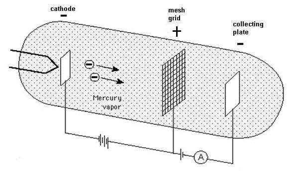
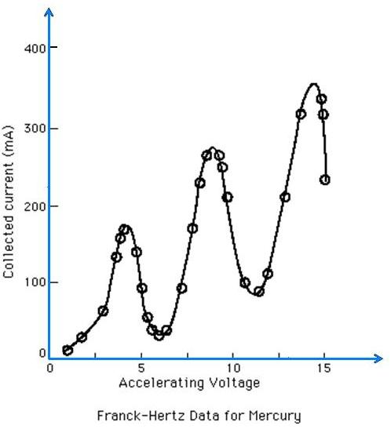
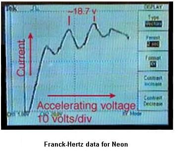

### Theory

Schematic representation of Franck-Hertz Apparatus

James Franck and Gustav Hertz conducted an experiment in 1914, which demonstrated the existence of excited states in mercury atoms. It confirms the prediction of quantum theory that electrons occupy only discrete, quantized energy states. This experiment supports Bohr model of atom. For this great invention they have been awarded Nobel Prize in Physics in the year 1925.

Apparatus used for the experiment consist of a tube containing low pressure gas, fitted with three electrodes: cathode for electron emission, a mesh grid for the acceleration of electrons and a collecting plate.

 

With the help of thermionic emission, electrons are emitted by a heated cathode, and then accelerated toward a grid which is at a positive potential, relative to the cathode. The collecting plate is at a lower potential and is negative with respect to mesh grid. If electrons have sufficient energy on reaching the grid, some will pass through the grid, and reach collecting plate, and it will be measured as current by the ammeter. Electrons which do not have sufficient energy on reaching the grid will be slowed down, and will fall back to the grid.The experimental results confirm the existence of discrete energy levels.

 

As long as the electron collision is elastic, the electrons will not lose energy on colliding with gas molecules in the tube. As the accelerating potential increases, the current also increases. But as the accelerating potential reaches a particular value, (4.9eV for mercury, 19eV for neon), each electron possesses that much of potential and now the collision becomes inelastic. As a result, the energy level of an electron bound to the atom is raised. Now the electron almost loses its energy, and measured current drops.

 ### Franck-Hertz Data for Mercury

 When the accelerating voltage reaches 4.9eV (lowest energy required by the mercury atom for excitation), the current drops sharply. This drop is due to inelastic collisions between the accelerated electrons and electrons in the mercury atoms. The sudden onset suggests that the mercury electrons cannot accept energy until it reaches the threshold to elevate them to an excited state. Collected current drops at multiples of 4.9eV. At 9.8 V, each electron gets sufficient energy to participate in two inelastic collisions. They excite two mercury atoms, and no energy will be left. This process will repeat, for each interval of 4.9eV.

 

### Franck-Hertz Data for Neon
 

For Neon gas, the process of energy absorption from electron collisions is clearly visible. When the accelerated electrons excite the electrons in neon to upper states, they de-excite in such a way as to produce a visible glow in the gas region in which the excitation is taking place. There are about ten excited levels in the range 18.3 to 19.5 eV. They de-excite by dropping to lower states at 16.57 and 16.79 eV. This energy difference gives light in the visible range. If the accelerating voltage is high enough, they can undergo a series of reactions, by the inelastic collision between electrons and neon gas. Almost similar pattern is observed in the case of neon gas at intervals of approximately 19 eV.

